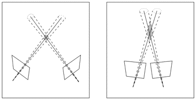
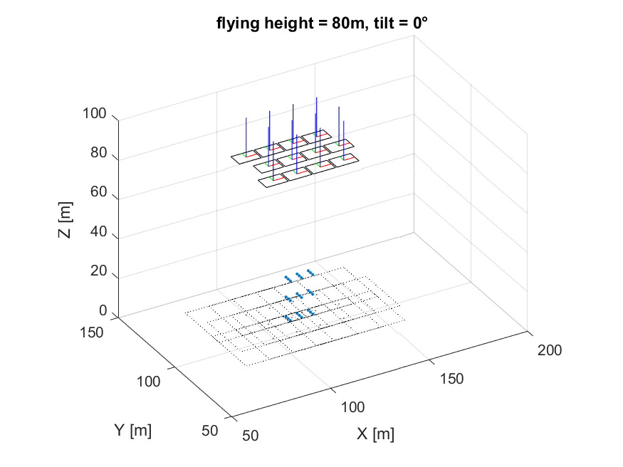

# uas-oblique-photo
A simulation of oblique photogrammetry from the UAS platform for accuracy assessment and mission planning.

## Overview
I wrote these scripts as part of my dissertation research into oblique photogrammetry from drones over forests. Collecting oblique imagery in airborne photogrammetry has been practiced for a long time for ubran areas because it produces better 3D reconstructions of vertical features such as walls. But I had noticed a dearth of studies of oblique photogrammetry from UAS over forests, and I thought it warranted further study.

### Dynamic, close-range photogrammetry
Conventional aerial photogrammetry practices assume a much higher flying height above ground than those achieved using drones, yet most missions for UAS photogrammetry were being planned using those practices. My thought was that, instead of thinking of it as low-altitude aerial photogrammetry, we should think of drone photogrammetry as *dynamic, close-range photogrammetry.*

*Capturing nadir photos from low altitudes seemed to result in "false positives," or reconstruction of features that simply weren't there. Shown here is a 3D reconstrution of a cluster of trees (left: true color; right: color by height (blue:low > red:high).*

I considered the much-shorter average range from camera to target when using a drone versus a manned aircraft. The relief displacement is much mroe exxagerated. In other words, there is an increased target height to flying height ratio (for example, the height of a building in relation to the height of the camera above it is drastically different from a drone than a conventional manned aircraft).

*Uncertainty in reconstruction (Hartley & Zisserman)*

The two main principles of close-range photogrammetry are

1. varying ranges of targets and 
2. strong geometry between camera stations.

Both of these can be acheived by capturing oblique images. To go further, both can be achieved using a single camera flown at a constant height above ground.

### Workflow
Applying these principles to drone photogrammetry should increase the accuracy of the resulting 3D reconstruction of the photos. My thought on the fastest way to test this contention was to run a few simulations of low-altitude, oblique photo capture in MATLAB.

1. Create a matrix of points in object space roughly the height of the trees typically seen in my study areas
2. Set an array of camera stations above these object space points at a given height and tilt
3. Back-project the object space points onto the camera stations—essentially creating virutal 2D images of the point array
4. Apply a bundle adjustment on these virtual images and the object space points and analyze the statistics on the adjustment

*Animation of the simulated environment created in MATLAB for testing oblique photo collection from low altitudes.*

### Supplemental information

You can read more about the simulations, the results, and their application to real-world photo collects [here](/supplemental) or [keep reading below](#experiment-control).

## missionSim.m
`missionSim()` creates a small simulated photo collection mission for testing bundle adjustment results with BUN2013.exe (not included in this repository).

### Call
`missionSim(endlap, sidelap, flying_height, tilt)`

### Input
`endlap`: endlap from photo to photo (0.0-1.0)

`sidelap`: sidelap from flight line to flight line (0.0-1.0)

`flying_height`: height above ground (meters)

`tilt`: angle of tilt of camera from nadir (deg)

### Output
The output is an ASCII file (.dat) which is formatted for input into a bundle adjustment software, BUN2013.exe, written by Bon Dewitt.

Reference: Wolf, Dewitt, Wilkinson. "Elements of Photogrammetry 4th ed."

## backProject.m
`backProject` back projects some array of object space coordinates into two images. This function assumes an ideal pinhole camera. Noise is added to the back-projected image coordinates.

### Call
`[x1, x2, noise] = backproject(X, cam1, cam2, sigma, format)`

### Input
`X`: `[n, n x 3]` matrix of `n` names, object space points of the format `[name, X, Y, Z]`

`cam`: row vector of external orientation parameters (EOPs) for camera `[XL, YL, ZL, tilt, [unused], azimuth, f(pix)]`

`sigma`: stdev of image measurements (typically 0.5 pixel) used to crete Gaussian noise

`format`: format of camera to serve as outer bounds of back-projections

### Output
`x`: `2 x n` matrix of image coordinates for cameras 1 & 2 `[x1, y1, x2, y2]`

Reference: Wolf, Dewitt, Wilkinson. "Elements of Photogrammetry 4th ed." Appendix D-4.

# Experiment control

The purpose for this simulation was to test whether oblique images provided an advantage over nadir images for structure-from-motion photogrammetry. The end goal was to test the two camera poses side by side over the same scene. I wanted only to vary the tilt of the camera while controlling for photo overlap and (to whatever extent possible) ground sample distance (GSD). I could not find equations to calculate photo overlap or GSD for oblique photos, so I derived them myself. (This is not to say earlier or better versions of these equations do not exist.)

## Calculating the air base and air width from endlap and sidelap

For airborne photogrammetry, the camera is commonly flown in a serpentine pattern of parallel flight lines. Photo overlap is characterized as **endlap**, or overlap between successive photos along the flight line, and **sidelap**, which is the overlap of photos across adjacent flight lines.

Both endlap and sidelap are expressed as a percentage. Given a percent endlap and sidelap, one can calculate the nominal **air base** $B$ and **air width** $W$, respectively. The air base is how far the camera should travel to achieve the desired endlap. The air width is the spacing between parallel flight lines.

For nadir images, one can calculate both $B$ and $W$ using simple trigonometry, as the footprint of a nadir image is a rectangle. The size of hte footprint is a simple function of the flying height and the camera's field of view. The footprint for a low oblique image, however, is a trapezoid. The equations traditionally used to find $B$ and $W$ do not account for tilt of the photo.

### Air base

For *low* oblique images, the air base $B$ between successive exposure stations 

$B = H' \left[ \tan{\left( t + \phi/2 \right)} - \tan{\left( t - \phi/2 \right)} \right] \left( 1 - E \right)$

where 
- $H'$ is the flying height, 
- $t$ is the tilt of the photo with respect to nadir, 
- $\phi$ is the field of view of the camera in the direction of flight, and 
- $E$ is the percent overlap $(0-1)$.

### Air width

The air width $W$ for low oblique images is expressed as

$W = H' \dfrac{w}{f \cos{t}} \left( 1 - S \right)$

where 
- $w$ is the format width, 
- $f$ is the focal length, and
- $S$ is the percent sidelap $(0-1)$.

## Variable ground sample distance for oblique images

The ground sample distance, or GSD, of an aerial photograph is the size of a pixel projected onto the ground below. For a nadir photo, each projected pixel is the same shape as the pixel (typically a square). For oblique photos, GSD is not only variable in the direction of tilt, but also each projected pixel is a trapezoid (assuming square pixels).

Ground sample distance $\mathrm{GSD}$ in the direction of tilt is expressed as

$\mathrm{GSD}(p) = H' \left[ \tan{\left( t + \mu_{p+1} \right)} - \tan{\left(t + \mu_p \right)} \right]$

$\mu_p = \arctan{\left( \dfrac{p-m/2}{f} \right)}$

where

- $p$ is the $p^{th}$ row/column of the format of the camera in the direction of tilt, assuming $p = 1$ is the pixel tilted lowest toward the ground, and
- $m$ is the number of rows or columns along the format of the camera, whichever of rows or columns is in the direction of tilt.
